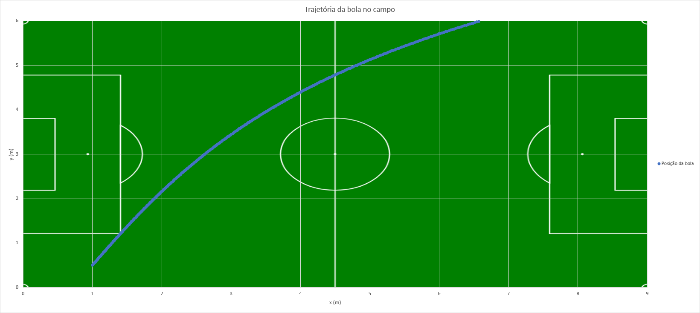

# ouroboros

 
 
<h3> <b>  O que é o projeto?</b> </h3>
 

 Projeto de física "Ora bolas", orientado pela professora Simone Camargo.

 O projeto consiste na criação de um software que calcule a menor rota de colisão de um robô, cuja posição inicial é aleatória, com uma bola em um jogo de futebol. Para a realização do cálculo também deve-se considerar: as dimensões do robô; o campo de futebol; e a trajetória da bola, pré-estabelecida pelo arquivo /recursos/trajetoria_1sem2019.txt.  

 Para mais informações consulte /recursos/Projeto_CF2111_Ora_bolas_2019.pdf

 
<h3> <b>  Dados: </b> </h3>
 
<ul>
	<li>Proporções do campo: 9m x 6m;</li>
	<li>Peso da bola: 0,046kg;</li>
	<li>Diâmetro da bola: 0,043m;</li>
	<li>Diâmetro máximo do robô: 0,18m;</li>
	<li>Velocidade máxima da bola: 6,5m/s. </li>
</ul>

Informações retiradas de  <a href="https://ssl.robocup.org/rules/">RoboCup</a>.

 
<h3> <b>  Trajetória da bola</b> </h3>
 

 
<h2 style="text-align: center;"> TO DO LIST </h2>
 
<ol>
	
<b>Cousas (ordem de relevância) </b>

	<li> Elaborar Cronograma  </li>
	<li> Definir velocidade máxima e aceleração máxima do robô </li>
	<li> Definir estrutura do programa </li>
	<li> Definir funções para recebimento de dados (pipes ou system)</li>
	<li> Definir funções para cálculo de velocidade média e instantânea </li>
	<li> Definir funções para plotagem de gráfico (gnuplot/biblioteca/QT)</li>
	<li> <b> OPCIONAL </b> Incluir engine de jogo (SDL2) </li>
</ol>
